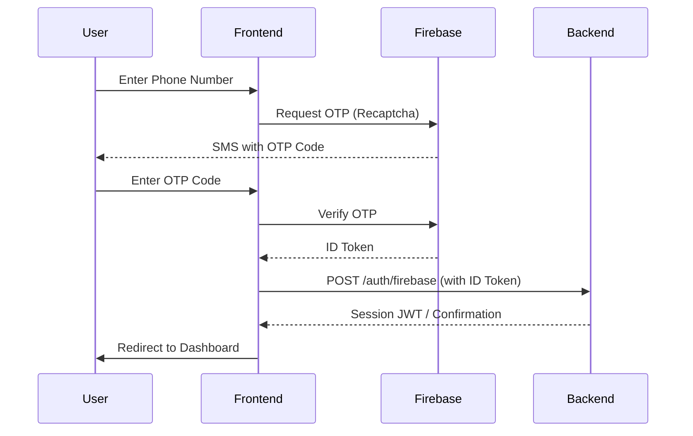
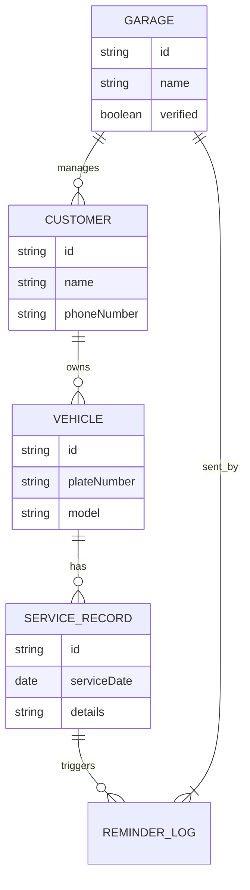
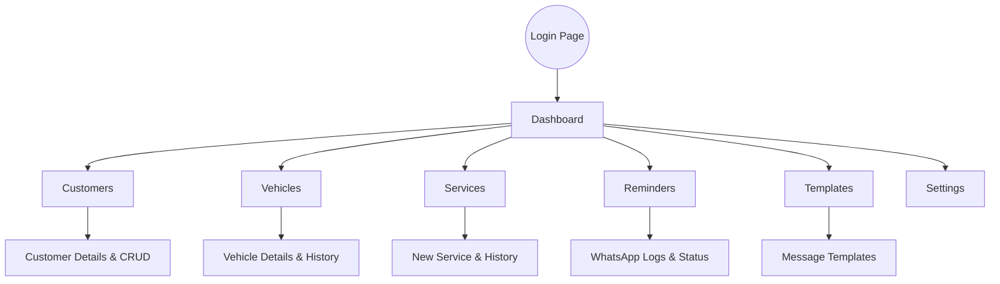

# Application Flowcharts

This document visualizes the core processes and structures of the Garage Management application.

## Authentication Flow (Firebase OTP)

## Data Relationship Model

## Admin Navigation Structure

